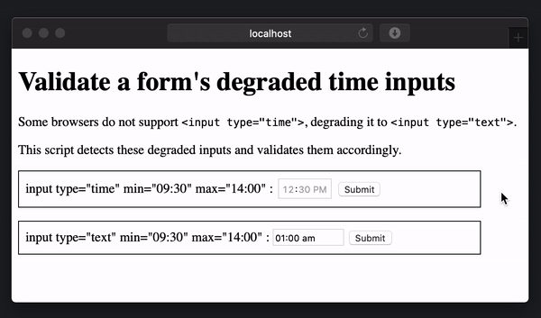

# input-time-validator

A cross-browser polyfill for `min` and `max` time validation to `<input type="time">`elements.



## The Problem

Some browsers do not support the input time element,
but degrade them to an input text element, which may longer be validated.

This input:
```html
<input type="time" min="09:00" max="16:00">
```
is converted to this degraded form:
```html
<input type="text" min="09:00" max="16:00">
```
By converting to `type="text"`, the min/max validation of user input is
eliminated.

## The Solution

Load this script at the end of the body:
```html
<script src="<path-to>inputTimeVal.js"></script>
```
which will detect any degraded input time elements and add a validation script to their parent forms.
